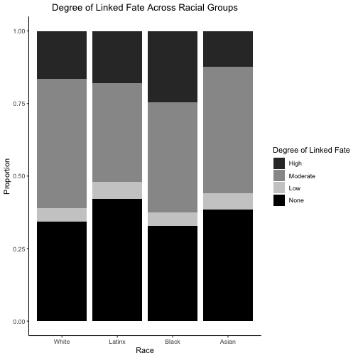

Racial Collectivism National Identity
========================================================
author: Jennifer St Sume
date: October 28, 2020
autosize: true

Outline
========================================================

- Research Question and Puzzle
- Theory  
- Data and Results
- Conclusion 

Puzzle
========================================================
Why do Black Americans feel any positive sentiment toward their national identity? 

Research Question
========================================================
Social Identity Theory (Tajfel et al. 1971; Tajfel and Turner 1979)

- individuals self-categorize
- they do so to feel good 

>RQ: What happens when a group member feels negatively toward their identity, such as Black Americans toward their national identity? 
   
    > A: Select an alternative referent 
    > EX: Black is Beautiful, Black Lives Matter, etc.
    

Theory: Racial Collectivism 
========================================================

I theorize that individuals use an alternative referent when coping with negative attachments. 

Racial collectivism is a group referent for political choice (Dawson 1994)

- racial collectivism -> political choice 
- I extend this to non-political choice
- I pose RC as a strategy to cope with the negative consequences of racial exclusion from national identity

Theory: Racial Collectivism 
========================================================
How much does linked fate matter for Blacks?

Hypotheses
========================================================

>H1: Racial collectivists will have a positive orientation toward national identity. (B > 0)

>H2: Strong racial collectivists will report different national identity than low racial collectivists. (B ≠ 0)

>H3: Racial collectivism will influence low-status and not dominant groups. (B = 0)

Data and Methods
=======================================================
Data are from **Collaborative Multiethnic Post-Election Survey 2016 (n=10,146)**

Empirical Strategy:

  1. subset to Black Americans and assess the role of RC
  2. subset to White Americans and assess the role of RC

Results: Black Americans
=======================================================

Results: White Americans
========================================================

Summary of Results
========================================================
The data suggests that:

- RC extends to **non-political choices**
- RC is an alternative **referent** 
- RC is **strategy** for low-status groups to cope with  negative consequences of racial exclusion

>Strategy/Process: "Conditional Nativism""

Conclusion
========================================================

-Comments on decscription of theory. 

-Comments on description of Conditional Naivism

-Comments of phrasing/approach to Hypothesis 2 (indifference)

References
========================================================

Tajfel, Henri, M.G. Billig, R.P. Bundy, and Claude Flament. 1971. "Social Categorization and Intergroup Behavior." European Journal of Social Psychology 1(2): 149–78.

Tajfel, Henri, and John Turner. 1979. "An Integrative Theory of Intergroup Conflict."

